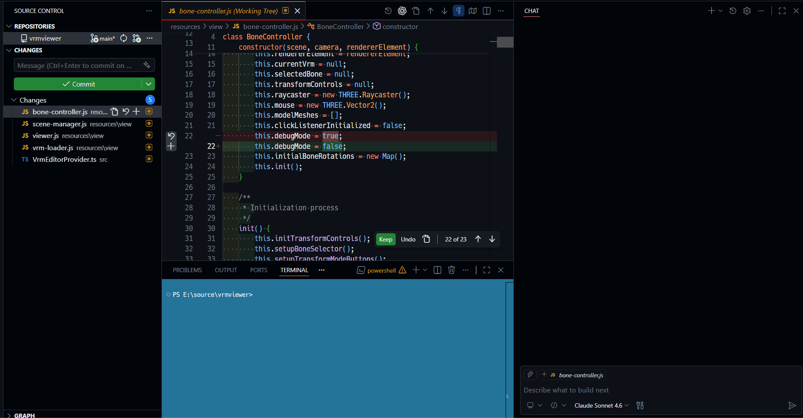

# Code Reviewer for Copilot

Review your SCM diffs with GitHub Copilot Chat by right-clicking a changed file.
Supports both Git and SVN repositories.

## Features

- **Context Menu Integration**: Right-click any file in the SCM view and select "Review with Copilot" to request a code review instantly
- **Multi-Selection Support**: Select multiple files and request a batch review in one action
- **Git and SVN Support**: Automatically detects Git and SVN repositories and retrieves the appropriate diff
- **New and Deleted File Support**: Correctly handles untracked (new) files and deleted files
- **Multi-Language Prompts**: Supports Japanese, English, Chinese (Simplified), Korean, French, German, and Spanish
- **Automatic Language Detection**: Selects the review language automatically based on the VS Code UI language
- **Custom Prompts**: Configure your own review prompt per language
- **Diff Size Limit**: Warns and handles gracefully when a diff exceeds 50KB

## Usage

### Review a Single File

1. Open the SCM view (Source Control panel) in VS Code
2. Right-click the file you want to review
3. Select **"Review with Copilot"** from the context menu
4. GitHub Copilot Chat opens with the diff pre-filled as a review request



### Review Multiple Files

1. Select multiple files in the SCM view (`Ctrl+Click` or `Shift+Click`)
2. Right-click one of the selected files
3. Select **"Review with Copilot"**
4. All selected diffs are sent to Copilot Chat in a single request

## Configuration

### Review Language

Specify the language used for the prompt sent to Copilot Chat.

```json
{
  "code-reviewer.reviewLanguage": "auto"
}
```

| Value | Description |
|---|---|
| `auto` | Automatically selected based on the VS Code UI language (default) |
| `ja` | Japanese |
| `en` | English |
| `zh-cn` | Chinese (Simplified) |
| `ko` | Korean |
| `fr` | French |
| `de` | German |
| `es` | Spanish |

### Custom Prompts

You can define a custom review prompt for each language.
Use `{{diff}}` as a placeholder for the diff content.
If `{{diff}}` is omitted, the diff is appended at the end of the prompt.
If left empty, the built-in template for that language is used.

```json
{
  "code-reviewer.reviewPrompt.en": "Review the following diff with a focus on security.\n\n{{diff}}"
}
```

Available setting keys:

| Setting Key | Language |
|---|---|
| `code-reviewer.reviewPrompt.ja` | Japanese |
| `code-reviewer.reviewPrompt.en` | English |
| `code-reviewer.reviewPrompt.zh-cn` | Chinese (Simplified) |
| `code-reviewer.reviewPrompt.ko` | Korean |
| `code-reviewer.reviewPrompt.fr` | French |
| `code-reviewer.reviewPrompt.de` | German |
| `code-reviewer.reviewPrompt.es` | Spanish |

## Requirements

- Visual Studio Code version 1.85.0 or higher
- GitHub Copilot Chat extension installed and signed in
- For SVN support: the `svn` command must be available in your PATH

## License

Licensed under MIT
